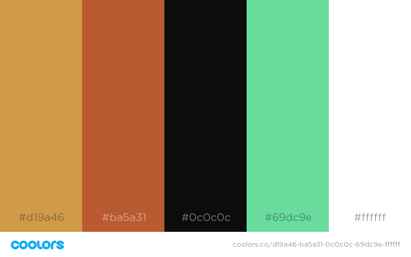

# CheetBook

CheetBook is currently a work in progress.

## What we are trying to build

We are trying to build a compilation of cheetsheets that developers can have as a handy guide while working with their favorite techs. 

## What we are trying to solve

This project tries to solve the challenge beginner developers like me have, like forgetting some important lines of code, figuring out what went wrong, and perhaps trying to hack a thing or two while working with `git`, `babel`, `webpack`, `sass`, `shell`, `eslint`, `react` and much more.

## Color Scheme

Intended color scheme is

