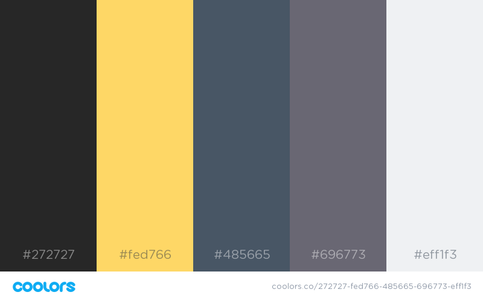

# CheetBook

Hey there... Welcome to `cheetBook` am glad you came all the way.

CheetBook is currently a work in progress. And we hope to build something we can all be proud of from this simple project.

## What we are trying to build

We are trying to build a compilation of cheetsheets that developers can have as a handy guide while working with their favorite techs.

## What we are trying to solve

This project tries to solve the challenge beginner developers like me have, like forgetting some important lines of code, figuring out what went wrong, and perhaps trying to hack a thing or two while working with `git`, `babel`, `webpack`, `sass`, `shell`, `eslint`, `react` and much more.

## Color Scheme

Intended color scheme is

Though our figma design has a bit of difference in the color scheme. We are likely to stick with the figma scheme.

## Milestones

Checkout the `milestone.md` file to see the current MVP

## Contributing

Thank you for your interest in contributing to the project. You should check out our [Contributing Docs](./.github/CONTRIBUTING.md) and also our [CODE_OF_CONDUCT](./CODE_OF_CONDUCT.md)