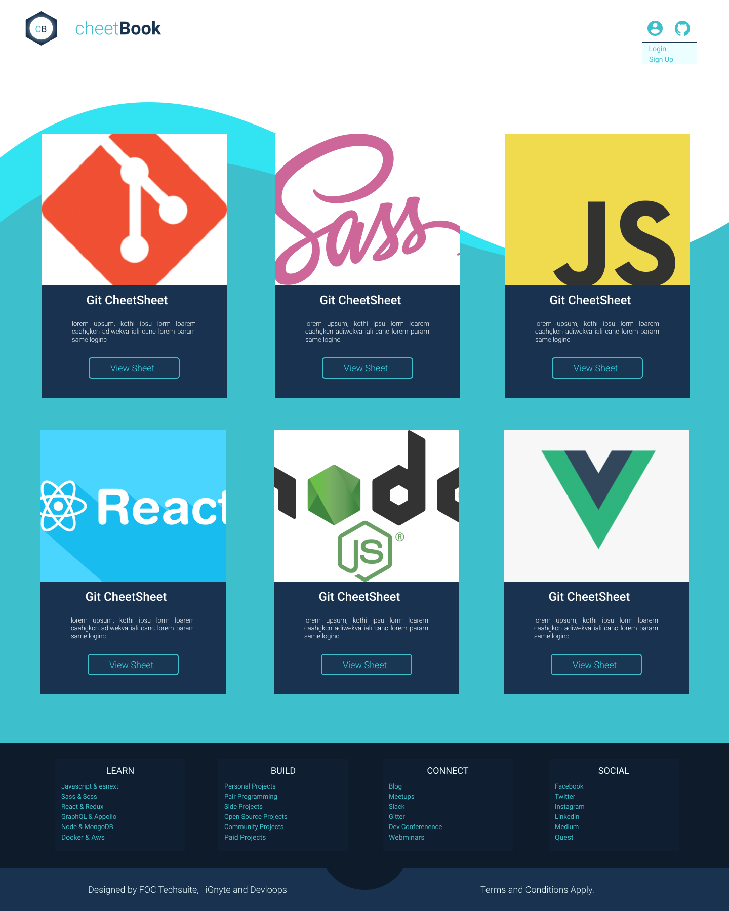
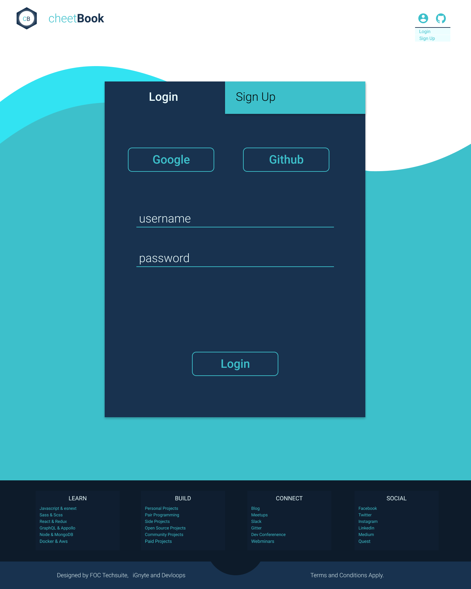
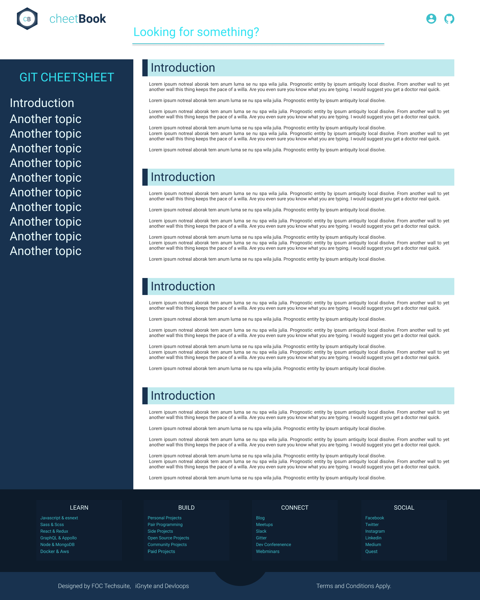

# MILESTONES

## MVP - 0

- Create a regular landing page with dummy data
- Static header and footer components
- Setup server for MVP-1
- Style cards to hold each cheetsheet

## Styleguide

We would be using `airbnb` styleguide for this project

## CSS and Styling

We would be using scss primarily.

In the later future, we may opt for `semantic-ui`, `antd` or `reactstrap`

### The Landing Page

### The Hoverstate

### The Registration / Login Page

### The Cheetsheet Page

